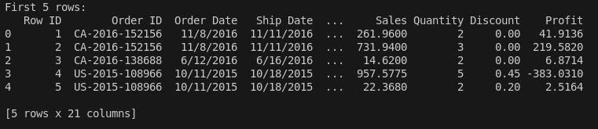
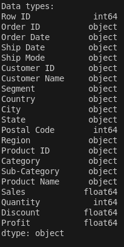
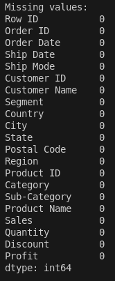
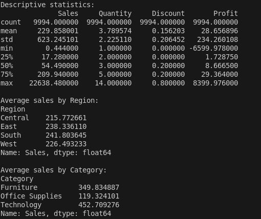
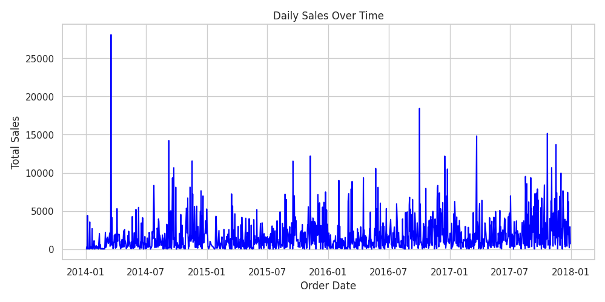
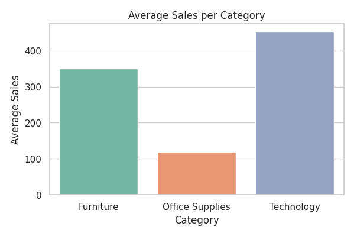
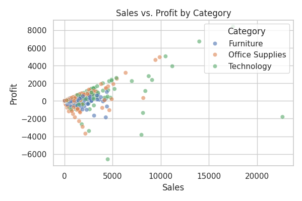
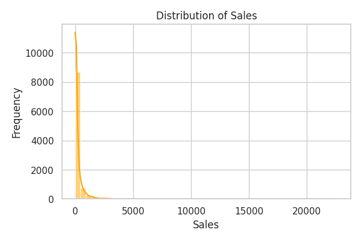

# 📊 Data Analysis with Pandas, Matplotlib, and Seaborn

This project analyzes the "Sample - Superstore.csv" dataset to explore sales trends, regional performance, and category insights using Python, Pandas, Matplotlib, and Seaborn.

## 📁 Project Structure

```
Data-Analysis-Pandas-Matplotlib-Seaborn/
├── images
├── Sample - Superstore.csv
├── analysis.py
├── requirements.txt
├── README.md
└── .gitignore
```

## ✅ Features

- Load and clean sales data from CSV
- Compute basic statistics (mean, median, std)
- Group analysis by Region and Category
- Generate visualizations:
  - 📈 Line chart: Sales over time
  - 📊 Bar chart: Average sales per category
  - 📉 Histogram: Distribution of sales
  - 🔁 Scatter plot: Sales vs. Profit

## 🚀 Setup Instructions

### 1. Clone or download this repository
```bash
git clone <repo-url>
cd Data-Analysis-Pandas-Matplotlib-Seaborn
```

### 2. Create a virtual environment (optional but recommended)
```bash
python3 -m venv venv
source venv/bin/activate
```

### 3. Install dependencies
```bash
pip install -r requirements.txt
```

### 4. Run the analysis
```bash
python analysis.py
```

## 📦 Dependencies

- pandas
- matplotlib
- seaborn

Install using:

```bash
pip install -r requirements.txt
```

## 📊 Dataset

- **Source**: `Sample - Superstore.csv`
- Contains order-level sales, profit, customer, and shipping data.

## 📸 Visualizations

### Columns


### Data Types


### Missing values


### Basic Statistics


### 📈 Line Chart – Sales Over Time


### 📊 Bar Chart – Average Sales per Category


### 🔁 Scatter Plot – Sales vs. Profit


### 📉 Histogram – Sales Distribution

